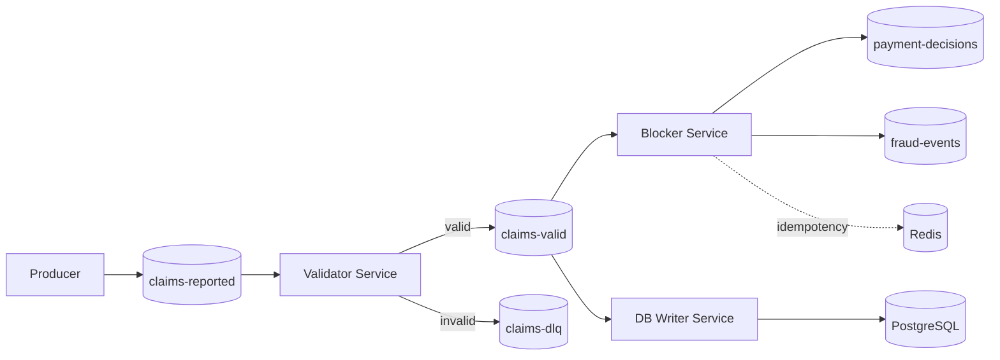
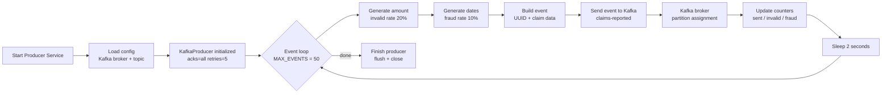
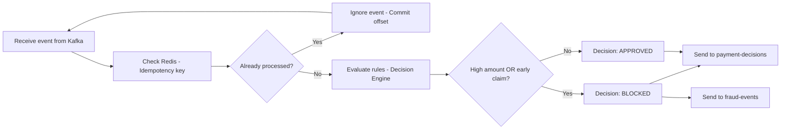
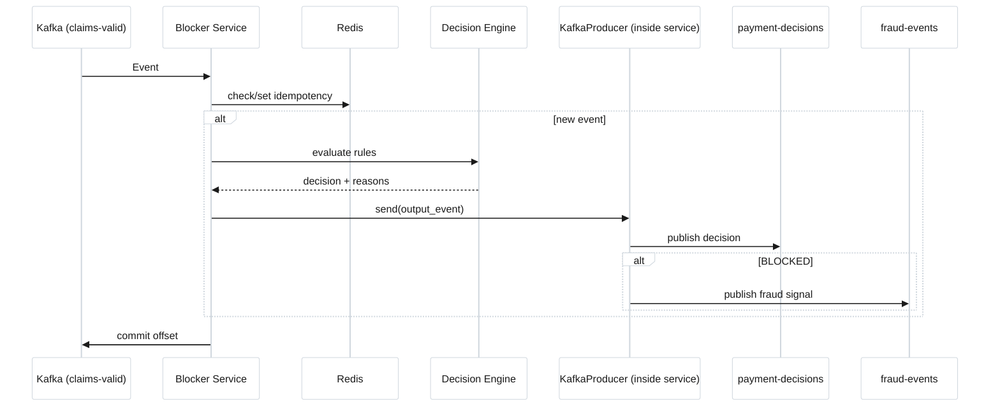
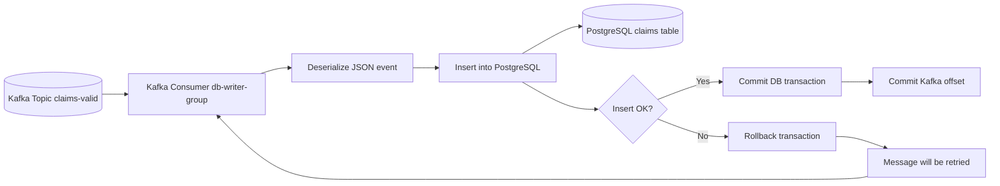

# README.md — Fraud Signal Engine — Event Driven Architecture

## 1. Caso de uso

El objetivo de esta práctica de consolidación es construir una arquitectura basada en eventos, con una aplicación realista, que procese información de forma asíncrona y/o en streaming, mantenga estado derivado y permita extensión y escalado.

Este proyecto implementa una arquitectura orientada a eventos para el procesamiento de siniestros (claims) de una compañía aseguradora en tiempo casi real: el sistema simula un flujo continuo de siniestros que se evaluan automáticamente para detectar posibles fraudes y mantener información persistida para auditoría y análisis posterior.

En concreto, el sistema desarrollado:

- Procesa eventos de forma asíncrona mediante una arquitectura orientada a eventos.
- Gestiona errores mediante una Dead Letter Queue (DLQ).
- Detecta posibles fraudes y genera decisiones de bloqueo o aprobación en tiempo casi real.
- Mantiene estado derivado y persistencia a partir de los eventos procesados.
- Permite escalar horizontalmente mediante consumidores independientes.
- Garantiza la persistencia y trazabilidad de los datos.

Cada siniestro reportado genera un evento que es publicado en Kafka y consumido por distintos servicios especializados. La solución utiliza Apache Kafka como backbone de eventos, Redis para mantener estado derivado e idempotencia, y PostgreSQL para persistencia de eventos. 

## 2. Flujo de eventos

### 2.1. Diagrama general




### 2.2. Descripción general

- El **Producer** genera eventos de reclamaciones (ClaimCreated) de forma continua y los envía a Kafka.
- **Kafka** recibe los eventos a un topic (claims-reported) y actúa como event bus central del sistema.
- El **Validator Service** valida los eventos y los redirige según el resultado a los topics (claims-valid / **DLQ** (claims-dlq)
- El **Blocker Service** consume los eventos válidos:
   - **Redis** se utiliza para garantizar idempotencia y evitar el reprocesamiento de eventos duplicados.
   - El sistema genera una decisión final según reglas simuladas de posible fraude (APPROVED o BLOCKED).
   - Los resultados se publican en:
     - payment-decisions (todos los eventos procesados)
     - fraud-events (sólo eventos bloqueados)
- El **Writing Service** consume todos los eventos del topic (claims-reported) y los persiste en **PostgreSQL**:
   - Se construye un histórico completo de siniestros para auditoría o análisis posterior.

### 2.3. Linaje de datos

| 🔹 Etapa                   | 📥 Entrada                                                   | ⚙️ Proceso                                                                                                                         | 📤 Salida                                                            |
| -------------------------- | ------------------------------------------------------------ | ---------------------------------------------------------------------------------------------------------------------------------- | -------------------------------------------------------------------- |
| **1. Producer**            | Parámetros aleatorios (`customerId`, `amount`, fechas, etc.) | Generación de evento `ClaimCreated`, simulación de fraude e inconsistencias                                                        | `Kafka: claims-reported`                                             |
| **2. Kafka (Event Bus)**   | Eventos desde Producer                                       | Persistencia, particionado por `customerId`, distribución pub/sub                                                                  | Eventos disponibles en `claims-reported`                             |
| **3. Validator Service**   | `Kafka: claims-reported`                                     | Validación de esquema y reglas de integridad (campos requeridos, tipos, coherencia de fechas). Separación de flujo válido/inválido | `Kafka: claims-valid` <br> `Kafka: claims-dlq (eventos inválidos)`   |
| **4. DLQ**                 | Eventos inválidos                               | Aislamiento de errores de validación y trazabilidad de fallos                                                                      | `Kafka: claims-dlq` (almacenamiento de errores)                      |
| **5. Blocker Service**     | `Kafka: claims-valid`                                        | Validación de negocio, idempotencia (Redis), reglas de posible fraude (`high_amount`, `early_claim`)                                       | `Kafka: payment-decisions` <br> `Kafka: fraud-events (solo BLOCKED)` |
| **6. Redis (State Store)** | `eventId` procesado (desde Blocker)                          | Control de idempotencia y deduplicación de eventos                                                                                 | `processed_claim_events:{eventId}`                                   |
| **7. Writing Service**     | `Kafka: claims-valid`                                        | Persistencia de datos validados (sin decisión de negocio)                                                                          | `PostgreSQL: claims table`                                           |


## 3. Componentes del sistema

### 3.1 Kafka Init

- Asegura la creación de los tópicos necesarios del sistema (claims-reported, claims-valid, payment-decisions, fraud-events y claims-dlq) con la configuración definida (particiones y factor de replicación)
- Garantiza que toda la infraestructura de mensajería esté lista antes de que los productores y consumidores comiencen a operar.
- Centraliza la preparación del entorno Kafka y evita dependencias implícitas o fallos por ausencia de tópicos en tiempo de ejecución.

### 3.2 Producer

- **Responsablidad:** crear eventos simulados de siniestros de una compañía de seguros.
  - crea eventos CLaimCreated:
      - se ha establecido un maximo de 50 eventos para el ejercicio
      - se ha establecido una espera de 2 segundos entre eventos
  - simula eventos fraudulentos (por importes o por fechas)
  - simula eventos no consistentes (vacíos)
  
- **Proceso:**
  Simula una fuente contínua de eventos cada pocos segundos, en este caso siniestros de una compañía de seguros, con su identificador, timestamp y atributos de negocio.     También simula eventos para poder detectar posibles situaciones de fraude e inconsistencias:


| Campo          | Ejemplo                                  | Descripción                                                        |
| -------------- | ---------------------------------------- | ------------------------------------------------------------------ |
| `eventId`      | `"c18f7a3b-9c2e-4d1a-a8f4-123456789abc"` | Identificador único del evento (UUID).                             |
| `eventRes`     | `"ClaimCreated"`                         | Resultado del evento generado.                              |
| `claimId`      | `"CLM-1234"`                             | Identificador único del siniestro.                   |
| `customerId`   | `"CUST-10"`                              | Identificador único del cliente asociado al siniestro.                |
| `amount`       | `25000`                                  | Importe económico asociado al siniestro.                  |
| `contractId`   | `"CON-56789"`                            | Identificador único del contrato asociado al siniestro.                         |
| `contractDate` | `"2024-01-10T00:00:00"`                  | Fecha de formalización o alta del contrato (ISO 8601) asociado al siniestro.             |
| `claimDate`    | `"2024-01-12T00:00:00"`                  | Fecha en la que se registró el siniestro (ISO 8601). |
| `timestamp`    | `"2025-06-01T10:00:00Z"`                 | Fecha y hora de generación del evento en UTC (ISO 8601).           |



  
- **Outuput:**
  - Kafka topic: claims-reported
     
- **Resultados:**
  - Flujo continuo de datos
  - Simulación realista de carga del sistema
  - Generación de eventos heterogéneos

### 3.3 Capa de transporte Kafka

- **Responsabilidad:**
  Kafka actúa como un event bus distribuido encargado del desacoplamiento entre productores y consumidores dentro del sistema.

- **Proceso:**
    - Recibe los eventos generados por el Producer, los almacena de forma persistente y los distribuye mediante el patrón Publish/Subscribe.
    - Garantiza el orden de procesamiento de los eventos pertenecientes a un mismo cliente mediante el particionado basado en customerId.
    - Permite el procesamiento paralelo y desacoplado de los mensajes a través de consumidores independientes organizados en grupos de consumo.

- **Resultados:**
   - Se obtiene una arquitectura escalable horizontalmente
   - Con alta tolerancia a fallos gracias a la persistencia de eventos
   - Flexible para la incorporación de nuevos consumidores sin necesidad de modificar los componentes existentes.
   - Capacidad inherente de reprocesamiento de eventos (replay) gracias a la persistencia del log de eventos y la gestión de offsets del consumidor.

### 3.4. Validation Service 

- **Responsabilidad:**
  Garantizar la calidad y consistencia de los datos antes de que entren en el flujo de negocio.

- **Proceso:**
  - Valida la estructura del evento (objeto json, y existencia de campos necesarios)
  - Comprueba reglas básicas de coherencia, como la relación entre fechas o la validez del importe.
  - Publica los eventos en topics según el resultado de la validación: 
      - si son válidos los publica en Kafka (claims-valid)
      - si no son válidos los envía al DLQ (claims-dlq), junto con el motivo del error.

- **Resultado:**
  Evita que datos corruptos o inconsistentes avancen en el pipeline y asegurando la fiabilidad del resto de consumidores.

- **Validaciones realizadas:**
  Se han incorporado las siguientes validaciones en el servicio, como ejercicio para el proyecto.
  En la realidad, habría que considerar incorporar las necesarias para la integridad del evento y el proceso posterior.

  | #  | Validación                                               | Código                                | Qué comprueba                                                   | Ejemplo inválido             | Reason en DLQ (`error`)                         |
  | -- | -------------------------------------------------------- | ------------------------------------- | --------------------------------------------------------------- | ---------------------------- | ----------------------------------------------- |
  | 1  | El evento debe ser un objeto JSON                        | `isinstance(event, dict)`             | Que el mensaje recibido sea un diccionario Python (objeto JSON) | `["dato1","dato2"]`          | `event must be a JSON object`                   |
  | 2  | Existencia de `eventId`                                  | `field not in event`                  | Que el campo exista                                             | Falta `eventId`              | `missing field eventId`                         |
  | 3-9 | Existencia de el resto de campos
  | 10 | `eventId` no vacío                                       | `event[field] in (None, "")`          | Que no sea `null` ni cadena vacía                               | `"eventId": ""`              | `empty field eventId`                           |
  | 11 | `claimId` no vacío                                       | `event[field] in (None, "")`          | Que no sea `null` ni cadena vacía                               | `"claimId": null`            | `empty field claimId`                           |
  | 12 | `customerId` no vacío                                    | `event[field] in (None, "")`          | Que no sea `null` ni cadena vacía                               | `"customerId": ""`           | `empty field customerId`                        |
  | 13 | `amount` no vacío                                        | `event[field] in (None, "")`          | Que no sea `null` ni cadena vacía                               | `"amount": null`             | `empty field amount`                            |
  | 14 | `contractDate` no vacía                                  | `event[field] in (None, "")`          | Que no sea `null` ni cadena vacía                               | `"contractDate": ""`         | `empty field contractDate`                      |
  | 15 | `claimDate` no vacía                                     | `event[field] in (None, "")`          | Que no sea `null` ni cadena vacía                               | `"claimDate": ""`            | `empty field claimDate`                         |
  | 16 | `timestamp` no vacío                                     | `event[field] in (None, "")`          | Que no sea `null` ni cadena vacía                               | `"timestamp": null`          | `empty field timestamp`                         |
  | 17 | `eventRes` no vacío                                      | `event[field] in (None, "")`          | Que no sea `null` ni cadena vacía                               | `"eventRes": ""`             | `empty field eventRes`                          |
  | 18 | Tipo de evento permitido                                 | `event["eventRes"] == "ClaimCreated"` | Sólo acepta eventos de creación de reclamación                  | `"eventRes": "ClaimUpdated"` | `eventRes must be ClaimCreated`                 |
  | 19 | Importe numérico                                         | `isinstance(amount, (int, float))`    | Que el importe sea numérico                                     | `"amount": "1000"`           | `amount must be numeric`                        |
  | 20 | Importe positivo                                         | `amount > 0`                          | Que el importe sea mayor que cero                               | `"amount": -500`             | `amount must be greater than zero`              |
  | 21 | Fecha de reclamación posterior o igual a la del contrato | `claim >= contract`                   | Que no se reclame antes de contratar                            | `claimDate < contractDate`   | `claimDate cannot be earlier than contractDate` |

- **Ejemplo de evento válido**
  
```json
{
  "eventId": "evt-001",
  "claimId": "claim-123",
  "customerId": "cust-456",
  "amount": 1500.75,
  "contractDate": "2025-01-01T00:00:00Z",
  "claimDate": "2025-06-15T00:00:00Z",
  "timestamp": "2025-06-15T10:30:00Z",
  "eventRes": "ClaimCreated"
}
```

### 3.5. DLQ (Dead Letter Queue)

- **Responsabilidad:**
  Aislamiento y gestión de eventos inválidos dentro del pipeline de datos.
  Recibe eventos erróneos, incompletos o que no pueden ser procesados correctamente por los consumidores del sistema y se redirigen al DLQ
   
- **Output:**
  Kafka topic: claims-dlq
```json
{
  "error": "missing field amount",
  "failedAt": "2026-06-05T10:00:00Z",
  "originalEvent": {
    "eventId": "123e4567-e89b-12d3-a456-426614174000",
    "eventRes": "ClaimCreated",
    "claimId": "CLM-4821",
    "customerId": "CUST-12",
    "amount": null,
    "contractId": "CON-98765",
    "contractDate": "2024-01-10T10:00:00Z",
    "claimDate": "2024-01-15T10:00:00Z",
    "timestamp": "2026-06-05T09:59:50Z"
  }
}
```
- **Resultados:**
  - Sistema altamente resiliente frente a datos  inválidos
  - Aislamiento efectivo de errores sin afectar el flujo principal
  - Mejora de la observabilidad del pipeline y trazabilidad de fallos
  - Posibilidad de análisis posterior para detección de problemas en la fuente de datos

### 3.6 Blocker Service (Fraud Signal Engine)

- **Responsabilidad:**
  Procesamiento en streaming y detección de posible fraude.

- **Proceso:**
  - Consume eventos de Kafka (topic: claims-reported)
  - Aplica reglas de negocio para la detección del posible fraude y genera la decisión final del evento basándose en ellas:
    - Un evento se marca como BLOCKED si el importe supera los 10.000 o si la reclamación se realiza en menos de 7 días desde la fecha del contrato
    - En caso contrario, el evento se clasifica como APPROVED.
  - Utiliza Redis para garantizar idempotencia (mregistro de eventId)
  - Publica el resultado del procesamiento en los topics:
    - payment-decisions, incluyendo el evento entiquecido con la decision final (APPROVED o BLOCKED) y las razones asociadas.
    - fraud-events, cuando un evento es clasificado como posible fraude (BLOCKED) (detección y monitorización de posible fraude en tiempo real)
      
- **Reglas de negocio aplicadas:**

  | # | Regla                | Condición                             | Reason generado | Resultado |
  | - | -------------------- | ------------------------------------- | --------------- | --------- |
  | 1 | Importe elevado      | `amount > HIGH_RISK_AMOUNT`           | `high_amount`   | `BLOCKED` |
  | 2 | Reclamación temprana | `(claimDate - contractDate).days < 7` | `early_claim`   | `BLOCKED` |

- **Matriz de decisión:**

  | Importe elevado | Reclamación temprana | Reasons                          | Decision   |
  | --------------- | -------------------- | -------------------------------- | ---------- |
  | No              | No                   | `[]`                             | `APPROVED` |
  | Sí              | No                   | `["high_amount"]`                | `BLOCKED`  |
  | No              | Sí                   | `["early_claim"]`                | `BLOCKED`  |
  | Sí              | Sí                   | `["high_amount", "early_claim"]` | `BLOCKED`  |

  
- **Output:**
   - Kafka topic: payment-decisions
   - Kafka topic: fraud-events (solo si BLOCKED)

    Relación entre los dos topics:
    | Aspecto      | payment-decisions        | fraud-events                    |
   | ------------ | ------------------------ | ------------------------------- |
   | Cobertura    | Todos los eventos        | Solo bloqueados                 |
   | Propósito    | Auditoría y trazabilidad | Seguridad y detección de fraude |
   | Tipo de uso  | Business layer           | Risk / Security layer           |
   | Cardinalidad | 1:1 con eventos          | Subconjunto                     |


- **Flowchart diagram:**




- **Sequence diagram:**




- **Resultados:**
  - Detecta posibles fraudes y genera decisiones de bloqueo o aprobación en tiempo casi real.
  - Consistencia en el procesamiento gracias a idempotencia en Redis.
  - Evita duplicados.

### 3.7. Estado (Redis)

- **Responsabilidad:**
  Almacenamiento de estado incremental, evita duplicados (idempotencia) y marca eventos procesados

- **Proceso:**
  - Para cada eventId se crea la clave processed_claim_events:<eventId> usando SET NX, de forma que solo se guarda si no existe previamente.
  - Cada clave tiene un TTL de 86400 segundos (24 horas) para no saturar el sistema, tras el cual expira automáticamente.
  - Si la clave ya existe, el evento se considera duplicado y se ignora sin volver a procesarse.
  
  | Elemento | Rol                                |
  | -------- | ---------------------------------- |
  | Redis    | Evitar duplicados                  |
  | Clave    | `processed_claim_events:<eventId>` |
  | Política | “solo procesar si no existe”       |
  | TTL      | 24 horas                           |
  | Impacto  | idempotencia del pipeline          |

- **Output:**
  Redis key: processed_claim_events:{eventId}

- **Resultados:**
  - Idempotencia, parcial dado que:
     - mientras el evento exista en REDIS (24h)
     - se basa sólo en la existencia del event_id, no en el contenido.
  - Evita reprocessing
  - Consistencia del pipeline

### 3.8. Writing Service

- **Responsabilidad:**
  Persistencia de eventos

- **Proceso**
  
  -  Consume los eventos del (topic: claims-valid)
  -  Realiza una inserción directa en la base de datos en PostgreSQL y garantiza la persistencia del evento forma resiliente.
  -  Controla manualmente el commit de offsets para garantizar consistencia entre streaming y base de datos:
       - enable_auto_commit=False → desactiva auto commit
       - consumer.commit() → commit manual tras insert exitoso 
 - Diagrama de flujo:


- **Output:**
  PostgreSQL table: claims

- **Resultados:**
  - Persistencia confiable de eventos procesados
  - Desacopla el procesamiento en streaming del almacenamiento persistente
  - Construcción de histórico estructurado de eventos para su posterior consulta en auditoría, análisis o reporting.


## 4. Tecnologías utilizadas

| Tecnología                  | Categoría                 | Rol en la arquitectura                     | Aporte al sistema                                                                                                                          |
| --------------------------- | ------------------------- | ------------------------------------------ | ------------------------------------------------------------------------------------------------------------------------------------------ |
| **Apache Kafka**            | Streaming / Event Bus     | Backbone de comunicación entre servicios   | Desacopla productores y consumidores, permite procesamiento asíncrono, escalabilidad horizontal mediante particiones y tolerancia a fallos |
| **Python**                  | Lenguaje de procesamiento | Implementación de todos los microservicios | Desarrollo rápido de lógica de negocio, validación y procesamiento de eventos                                                              |
| **kafka-python**            | Cliente de integración    | Conexión de servicios con Kafka            | Permite implementar producers/consumers, gestión de offsets y envío de eventos                                                             |
| **Redis**                   | State store en memoria    | Control de idempotencia en Blocker Service | Evita duplicados mediante almacenamiento temporal de `eventId`, mejora consistencia en procesamiento                                       |
| **PostgreSQL**              | Persistencia              | Base de datos final del sistema            | Almacenamiento estructurado y duradero de eventos procesados/validados                                                                     |
| **Docker & Docker Compose** | Orquestación              | Entorno de ejecución completo              | Facilita despliegue local reproducible de toda la arquitectura distribuida                                                                 |
| **JSON**                    | Formato de eventos        | Contrato de datos entre servicios          | Permite intercambio flexible de eventos entre servicios sin esquema rígido                                                                 |


## 5. Patrones del sistema

La arquitectura utilizada es event-driven con separación explícita entre capa de calidad de datos, capa de persistencia y capa de lógica de negocio, donde Kafka actúa como backbone del sistema:

| Patrón                                        | Dónde se aplica   | Cómo se implementa en el proyecto                                                 | Aporte al sistema                                                            |
| --------------------------------------------- | ----------------- | --------------------------------------------------------------------------------- | ------------------------------------------------------------------- |
| **Event-Driven Architecture**                 | Todo el sistema   | Comunicación asíncrona mediante Kafka entre Producer, Validator, Blocker y Writer | Desacopla servicios y permite procesamiento distribuido y escalable |
| **Pipeline de datos (Data Pipeline)**         | End-to-end flow   | Flujo secuencial: `claims-reported → claims-valid → processing paralelo`          | Permite tratamiento progresivo de calidad de datos                  |
| **DLQ (Dead Letter Queue)**                   | Validator Service | Eventos inválidos enviados a `claims-dlq`                                         | Aislamiento de errores sin interrumpir el flujo principal           |
| **Idempotencia**                              | Blocker Service   | Redis almacena `eventId` procesados                                               | Evita duplicados en el procesamiento de eventos                     |
| **Fan-out (derivación de eventos)**           | Blocker Service   | Un mismo evento genera `payment-decisions` y `fraud-events`                       | Permite múltiples derivaciones de un mismo evento de negocio        |
| **Separación de concerns (data vs decision)** | Writer vs Blocker | Writer consume `claims-valid`, Blocker genera decisiones independientes           | Desacopla persistencia de datos de la lógica de negocio             |
| **Schema-less contract (JSON)**               | Todo el sistema   | Eventos en JSON sin esquema formal rígido                                         | Flexibilidad en evolución del modelo de eventos                     |
| **Pub/Sub (Kafka)**                           | Topics Kafka      | Múltiples consumidores sobre `claims-valid` y otros topics                        | Escalabilidad horizontal y consumo independiente por servicio       |

  
## 12. Observaciones / Limitaciones conocidas / Mejoras

### Particionado Kafka

Los eventos se publican utilizando customerId como clave de particionado, lo que garantiza que todas las reclamaciones de un mismo cliente se procesen en orden dentro de la misma partición. 

Aunque en la implementación actual cada claim se evalúa de forma independiente y claimId podría proporcionar una distribución de carga más uniforme, se ha optado por customerId para facilitar futuras reglas de fraude basadas en el historial o comportamiento del cliente. 

### Validation Service

El Validation Service actúa como una etapa independiente, consumiendo eventos desde claims-reported y publicando únicamente eventos válidos en claims-valid, con el fin de mantener una separación clara entre servicios.

La escalabilidad del Validation Service se consigue mediante el uso de consumer groups de Kafka: al particionar el topic claims-reported, Kafka distribuye las particiones entre múltiples instancias del validador, permitiendo procesamiento paralelo, eliminando cuellos de botella mediante el escalado horizontal del servicio.

  - kafka-topics.sh --create --topic claims-reported --partitions 3
  - kafka-topics.sh --create --topic claims-valid --partitions 3
  - kafka-topics.sh --create --topic payment-decisions --partitions 3


### DLQ sin reprocess pipeline

Actualmente, el sistema incluye una Dead Letter Queue (claims-dlq) donde se almacenan los eventos inválidos detectados por el Validation Service, pero no cuenta con un mecanismo de re-procesamiento automático ni con un flujo operativo definido para su recuperación y los eventos requieren intervención manual para ser reintroducidos en el sistema.

- Punto de mejora: incorporar un “DLQ replayer service” para reinyectar de forma controlada los eventos corregidos en el flujo principal, así como un panel de monitorización que facilite la revisión, análisis y reenvío manual de estos eventos.

### Duplicados en Kafka (at-least-once)

Como mitigación actual para la configuración estándar de at-least-once delivery, únicamente el Blocker implementa idempotencia mediante Redis utilizando claves con TTL, evitando el reprocesamiento de eventos recientes.

- Como mejora, reforzar la idempotencia en la capa de persistencia mediante constraints únicos en base de datos (por ejemplo, claimId) o lógica de deduplicación en el Writer, garantizando así consistencia incluso ante reentregas de Kafka.


### Writing Service

El Writing Service persiste datos aún no enriquecidos con la decisión de negocio del sistema (Fraud Signal Engine). Una evolución natural del sistema sería modificar el consumidor para que lea desde payment-decisions, de forma que la persistencia refleje el estado final del proceso, incluyendo la decision y las reasons asociadas. 

Esta transición implicaría la necesidad de formalizar el contrato de eventos, introduciendo versionado de esquema (por ejemplo schemaVersion) o mecanismos de validación, para garantizar la compatibilidad hacia atrás y facilitar la evolución del modelo reduciendo riesgos de roturas entre productoes y consumidores ante cambios en la lógica de negocio. 

### Versiones de eventos

No existe explícitamente versionado de eventos en runtime (schemaVersion), compatibilidad entre versiones o estrategia de evolución de contratos:

- Punto de mejora: Introducir un sistema formal de versionado de eventos que permita la evolución del sistema de forma segura y gobernada.


### Estado y agregados 

Actualmente, el sistema incorpora gestión de estado básico reduciendo duplicados y manteniendo consistencia operativa (gracias al Redis y al estado implícito a nivel de offset que introduce kafka), aunque esto no constituye un sistema de gestión de estado completo a nivel de entidad o dominio. Por otro lado, el sistema aún no implementa agregaciones de estado avanzadas.

- Punto de mejora:
  - Unificar la gestión de estado bajo un modelo más coherente y explícito, para conseguir una fuente única de verdad.
  - Evolucionar el sistema hacia un modelo más completo con capacidades analíticas en tiempo real:
    - total de claims por customerId
    - número de eventos de fraude por día
    - sumas de importes por periodos temporales
    - métricas basadas en ventanas deslizantes (rolling windows)


## 13. Conclusión

El objetivo de la práctica de consolidación de las clases de ARQUITECTURA BASADA EN EVENTOS es “Construir una arquitectura basada en eventos que procese información de forma asíncrona y/o en streaming, mantenga estado derivado y permita extensión y escalado”.

### 13.1. Conclusión técnica:

La solución propuesta 

- contiene una arquitectura event-driven basada en Kafka, en la que los servicios se comunican de forma asíncrona a través de eventos, eliminando el acoplamiento directo y permitiendo el escalado independiente de cada componente.

- se estructura como un pipeline de procesamiento compuesto por etapas definidas —generación de eventos, validación, aplicación de reglas de negocio y persistencia—, donde cada servicio asume una responsabilidad específica dentro del flujo, mejorando la mantenibilidad y la extensibilidad del sistema.

- El procesamiento se realiza en near real-time, utilizando Kafka como backbone de eventos y apoyándose en consumer groups y particiones para habilitar escalado horizontal.

- En cuanto a la gestión de estado, el sistema combina Redis para idempotencia, Kafka como log distribuido persistente y PostgreSQL como capa final de almacenamiento, resultando en un modelo de estado distribuido entre componentes.

En conjunto, la arquitectura implementada procura reflejar un diseño modular, escalable, cumpliendo los objetivos funcionales de procesamiento asíncrono, extensibilidad y escalabilidad definidos en la práctica.

### 13.2. Conclusión operativa:

Aunque el sistema no es aún “enterprise real” en cuanto a observabilidad, gobernanza de esquemas o consistencia end-to-end, pretende implementar de forma realista un caso de uso de procesamiento de claims y detección de posible fraude en near real-time. 


## 14. LOGS

###. Claims-Producer

producer started broker=kafka:9092 topic=claims-reported

sent eventId=5f448e7a-d8c7-4748-9a39-02930dc81f35 customer=CUST-44 partition=0 offset=0 invalid=False fraud_pattern=False
sent eventId=4f6079ae-fa7b-4ba6-8b6b-0b0113a5c532 customer=CUST-33 partition=0 offset=1 invalid=True fraud_pattern=False
sent eventId=cac9225a-7e9c-40e5-836a-3654a3d69789 customer=CUST-45 partition=1 offset=0 invalid=False fraud_pattern=False
sent eventId=811483ca-d45d-4528-8edf-6f849b1169a0 customer=CUST-12 partition=2 offset=0 invalid=False fraud_pattern=False
sent eventId=ba12f523-47aa-4974-a70a-e84442ce7044 customer=CUST-7 partition=0 offset=2 invalid=False fraud_pattern=True
sent eventId=6c0699d4-9af1-4e8d-b12c-51deee4651a1 customer=CUST-31 partition=1 offset=1 invalid=False fraud_pattern=False

### KAFKA INIT

Created topic claims-reported.
Created topic claims-valid.
Created topic payment-decisions.
Created topic fraud-events.
Created topic claims-dlq.

### VALIDATOR-SERVICE

AttributeError: 'NoneType' object has no attribute 'encode'
validator started input=claims-reported valid=claims-valid dlq=claims-dlq
VALID eventId=5364ab87-4e98-4be1-a498-beac6e30ef71 claimId=CLM-7437
VALID eventId=efb12b0c-7f64-4138-840f-277e62bb4fc5 claimId=CLM-1714
VALID eventId=93acd153-c428-48ea-b1be-ed9bd40ef0a9 claimId=CLM-5251

### REDIS-FRAUD

1:C 04 Jun 2026 21:48:38.299 * oO0OoO0OoO0Oo Redis is starting oO0OoO0OoO0Oo
1:C 04 Jun 2026 21:48:38.299 * Redis version=7.4.9, bits=64, commit=00000000, modified=0, pid=1, just started
1:C 04 Jun 2026 21:48:38.299 # Warning: no config file specified, using the default config. In order to specify a config file use redis-server /path/to/redis.conf
1:M 04 Jun 2026 21:48:38.299 * monotonic clock: POSIX clock_gettime
1:M 04 Jun 2026 21:48:38.303 * Running mode=standalone, port=6379.
1:M 04 Jun 2026 21:48:38.305 * Server initialized
1:M 04 Jun 2026 21:48:38.305 * Ready to accept connections tcp

### BLOCKER-SERVICE

BLOCKED claimId=CLM-4202 reasons=['high_amount']
APPROVED claimId=CLM-3562 reasons=[]
APPROVED claimId=CLM-7700 reasons=[]
BLOCKED claimId=CLM-6598 reasons=['high_amount']
BLOCKED claimId=CLM-8642 reasons=['high_amount']
BLOCKED claimId=CLM-8509 reasons=['high_amount']
APPROVED claimId=CLM-6830 reasons=[]
BLOCKED claimId=CLM-5608 reasons=['high_amount']
BLOCKED claimId=CLM-1930 reasons=['early_claim']

### POSTGRESS

PostgreSQL Database directory appears to contain a database; Skipping initialization
2026-06-04 21:48:38.333 UTC [1] LOG:  starting PostgreSQL 16.14 on x86_64-pc-linux-musl, compiled by gcc (Alpine 15.2.0) 15.2.0, 64-bit
2026-06-04 21:48:38.333 UTC [1] LOG:  listening on IPv4 address "0.0.0.0", port 5432
2026-06-04 21:48:38.333 UTC [1] LOG:  listening on IPv6 address "::", port 5432
2026-06-04 21:48:38.354 UTC [1] LOG:  listening on Unix socket "/var/run/postgresql/.s.PGSQL.5432"
2026-06-04 21:48:38.373 UTC [29] LOG:  database system was shut down at 2026-06-04 21:41:20 UTC
2026-06-04 21:48:38.387 UTC [1] LOG:  database system is ready to accept connections
2026-06-04 21:53:38.456 UTC [27] LOG:  checkpoint starting: time
2026-06-04 21:53:39.685 UTC [27] LOG:  checkpoint complete: wrote 15 buffers (0.1%); 0 WAL file(s) added, 0 removed, 0 recycled; write=1.207 s, sync=0.014 s, total=1.229 s; sync files=9, longest=0.006 s, average=0.002 s; distance=56 kB, estimate=56 kB; lsn=0/19E69B0, redo lsn=0/19E6978

### WRITING-SERVICE

[DB-WRITER] ------------------------------
[DB-WRITER] message received from Kafka ✔
[DB-WRITER] payload: {'eventId': '71b0ab53-faed-4f91-a516-6a37e4d2edcc', 'eventRes': 'ClaimCreated', 'claimId': 'CLM-7727', 'customerId': 'CUST-22', 'amount': 11212, 'contractId': 'CON-93254', 'contractDate': '2025-08-27T19:41:03', 'claimDate': '2025-10-11T19:41:03', 'timestamp': '2026-06-04T21:50:18.167849Z', 'decision': 'BLOCKED', 'reasons': ['high_amount']}
[DB-WRITER] INSERTED: CLM-7727
[DB-WRITER] DB commit ✔
[DB-WRITER] Kafka offset committed ✔
[DB-WRITER] ------------------------------
[DB-WRITER] message received from Kafka ✔
[DB-WRITER] payload: {'eventId': '2f8fd7b2-ba98-4ecf-8b69-4e0b64a87116', 'eventRes': 'ClaimCreated', 'claimId': 'CLM-6525', 'customerId': 'CUST-21', 'amount': 1592, 'contractId': 'CON-33555', 'contractDate': '2025-09-02T20:53:37', 'claimDate': '2025-12-01T20:53:37', 'timestamp': '2026-06-04T21:50:20.171185Z', 'decision': 'APPROVED', 'reasons': []}
[DB-WRITER] INSERTED: CLM-6525
[DB-WRITER] DB commit ✔
[DB-WRITER] Kafka offset committed ✔

### PRODUCER AFTER 50 EVENTS

sent eventId=82bef3c8-5f8b-42e9-a2e8-f44093356635 customer=CUST-5 partition=1 offset=14 invalid=False fraud_pattern=False
sent eventId=ba46ec86-a924-40db-ab55-549bc0597768 customer=CUST-13 partition=2 offset=14 invalid=False fraud_pattern=False
sent eventId=8050e08e-e372-4961-8e79-ff930ae73c4b customer=CUST-7 partition=0 offset=17 invalid=False fraud_pattern=False
sent eventId=bec6afda-b341-4864-88ac-bba2bbf5fcc2 customer=CUST-10 partition=2 offset=15 invalid=True fraud_pattern=True
sent eventId=6edd3ef9-e2f1-49fe-8549-3337419220a1 customer=CUST-29 partition=2 offset=16 invalid=False fraud_pattern=False
finished sent=50 invalid_generated=4 fraud_patterns=5
